Developer focused on building efficient systems, automation tools, desktop applications, embedded solutions, and high-performance software.

Creator of MekaWeapons, a Minecraft mod with over 4 million downloads.

## Tech Stack

C • C++ • C# • Java • Python • Avalonia UI • .NET • ESP32

## What I Do

- Back-end Development
- Desktop Applications
- Embedded Systems (ESP32)
- Automation & Tooling
- Performance Optimization
- Reverse Engineering

## Projects

### MekaWeapons

An open-source Minecraft mod extending the Mekanism ecosystem with advanced weapons and combat mechanics.

### Framenion

Cross-platform desktop application built with Avalonia UI, providing Warframe players with a fast and lightweight companion experience. Designed with a focus on performance, responsiveness, and modern desktop application architecture.

### ESP32 Keyboard

ESP32-based Bluetooth HID device demonstrating embedded systems development, wireless communication, and hardware-software integration.

---

  

---

> Performance is a feature.
